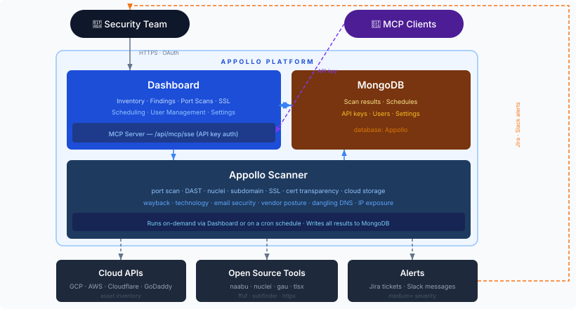

<div align="center">
  <br><br>
  <h1>Appollo</h1>
  <p><strong>Continuous Attack Surface Management for modern cloud infrastructure</strong></p>
  <p>
    <a href="#architecture">Architecture</a> ·
    <a href="#scan-modules">Modules</a> ·
    <a href="#getting-started">Getting Started</a> ·
    <a href="#flag-reference">CLI Reference</a> ·
    <a href="#deployment">Deployment</a> ·
    <a href="#related-repositories">Related Repos</a>
  </p>
  <p>
    
    
    
  </p>
</div>

---

## Overview

**Appollo** is an open-source Attack Surface Management (ASM) platform. It continuously enumerates, monitors, and assesses the security posture of an organization's external-facing infrastructure — spanning DNS, subdomains, SSL certificates, cloud assets, open ports, exposed directories, and known CVEs.

Appollo is designed to run on a schedule (via Kubernetes CronJob or a simple cron) and push findings directly to your team via **Slack** alerts and **Jira** tickets, while persisting all results in **MongoDB** for trend analysis and dashboarding.

It pairs with two companion projects that together form the full platform:

- **[Appollo Dashboard](https://github.com/Groww-OSS/Appollo-Dashboard)** — a Next.js web UI for browsing inventory, findings, and scan history
- **[Appollo API](https://github.com/Groww-OSS/Appollo-API)** — a lightweight Flask API that serves as the scan trigger layer; the dashboard calls Appollo API to start scans on demand

All three components share the same MongoDB instance. Appollo writes results; Appollo API and the Dashboard read and expose them.

---

## How It Works

1. **Inventory first** — Run `-U` (update inventory) to pull assets from GCP (all projects via Cloud Resource Manager v3), AWS (all accounts via assume-role), and Cloudflare DNS zones. Results are stored in MongoDB as the source of truth for all subsequent scans.

2. **Target resolution** — Every scan module calls `get_all_targets()` which returns three sets: IPs, hostnames (DNS targets), and a combined set. HTTP-based scans (DAST, directory scan) get hostnames only to avoid TLS/vhost mismatches; network scans (port scan, nuclei) get IPs + hostnames.

3. **Scan → deduplicate → alert** — Each module stores findings with a content hash. Duplicate findings are silently skipped. New findings trigger a Jira ticket (for medium severity and above) and a Slack summary message.

4. **Dashboard + scheduling** — The Dashboard's `/api/scans/scheduler/tick` endpoint, called every 15 minutes by a K8s CronJob, reads `ScanSchedules` from MongoDB and fires any overdue scans via Appollo API. You can configure per-scan-type frequency and enable/disable individual scan types from the Settings page.

---

## Architecture



**Trust boundaries**

| Boundary | Enforcement |
|---|---|
| Internet → Cluster | Ingress only; scan pods are egress-only to targets |
| `appollo` → `appollo-scans` | Appollo API crosses via K8s Jobs API under RBAC only |
| User → Dashboard | Google OAuth + per-user MongoDB whitelist |
| MCP Client → Dashboard | Hashed API keys stored in `api_keys` collection |
| Credentials | Mounted as K8s Secrets — never baked into images |
| Deployments | ArgoCD GitOps — no direct `kubectl apply` to production |

---

## Scan Modules

| Flag | Module | Description | Powered by |
|------|--------|-------------|------------|
| `-U` | `update-inventory` | Pull all assets from GCP, AWS, Cloudflare, GoDaddy. The foundation for all other scans. | GCP CRM v3 · AWS boto3 · Cloudflare API |
| `-sc` | `ssl-checker` | Check SSL certificate validity and expiry across all DNS targets. Cross-verified against crt.sh CT logs. | **tlsx** |
| `-fs` | `firewall-port-scan` | GCP + AWS firewall-aware port scan. Combines cloud API rule context with active scanning and external probe confirmation. Runs a DNS-target port sweep automatically as a supplement. | **naabu** · GCP/AWS APIs |
| `-es` | `exposed-services-scan` | Top-1000 port scan against all public IPs. HTTP-probes each open port and classifies results as `public`, `auth_wall`, or `tcp_only`. | **naabu** · **httpx** |
| `-ipe` | `ip-exposure-scan` | Classify every IP in inventory as `public`, `vpn_internal`, or `unknown` using firewall rules, resource type, and Cloudflare DNS signals. | GCP/AWS APIs |
| `-ep` | `external-probe-scan` | Confirm true internet reachability via an external AWS Lambda prober — distinguishes VPN-internal from genuinely public. | AWS Lambda |
| `-pa` | `probe-all-scan` | Run the external Lambda prober across all collections (Exposed Services, Port Scans) in one pass. | AWS Lambda |
| `-dast` | `dast-scan` | DAST checks: security headers, CORS, open redirects, info disclosure, HTTP→HTTPS redirect, and template-based vulnerability scanning. | **nuclei** · httpx |
| `-ns` | `nuclei-scan` | Template-based vulnerability scanning across all IPs and hostnames. | **nuclei** |
| `-ds` | `dir-scan` | Directory/path fuzzing against live HTTP endpoints. | **ffuf** |
| `-ws` | `wayback-scan` | Pull historical endpoints from Wayback Machine and CommonCrawl. | **gau** |
| `-sub` | `subdomain-scan` | Subdomain enumeration. Discovered subdomains are written back to DNS Records for use by subsequent scans. | **subfinder** |
| `-cf` | `cloud-functions-scan` | Detect publicly invokable serverless endpoints — Lambda Function URLs, API Gateway stages, GCP Cloud Functions, and Cloud Run services. | GCP/AWS APIs |
| `-cs` | `cloud-storage-scan` | Detect publicly exposed GCS and S3 buckets. Reports anonymous read, list, and write access. | GCP/AWS APIs |
| `-ct` | `cert-transparency-scan` | Query certificate transparency logs for certificates issued against your domains. | crt.sh API |
| `-dd` | `dangling-dns` | Find DNS records pointing to decommissioned resources — potential subdomain takeover vectors. | DNS · cloud APIs |
| `-em` | `email-security-scan` | Check SPF, DKIM, DMARC configuration for all root domains. | DNS queries |
| `-ts` | `tech-scan` | Technology stack fingerprinting via BuiltWith API. | BuiltWith API |
| `-as` | `aws-scan` | Deep AWS asset scan — EC2 instances, S3 buckets, security groups, IAM surface. | AWS boto3 |
| `-vs` | `vendor-scan` | Full external posture assessment for a third-party vendor. Requires `-V <vendor-slug>`. | multi-module |
| `-g` | `godaddy-scan` | Parse and ingest GoDaddy zone file exports. | GoDaddy API |
| `-A` | `complete-scan` | Run all modules (except vendor scan) in a single invocation. | all above |

---

## Getting Started

### Prerequisites

Appollo relies on several external tools. Install them before running:

```bash
# Nuclei — CVE and template-based scanning
go install -v github.com/projectdiscovery/nuclei/v3/cmd/nuclei@latest

# naabu — fast port scanner
go install -v github.com/projectdiscovery/naabu/v2/cmd/naabu@latest

# subfinder — subdomain enumeration
go install -v github.com/projectdiscovery/subfinder/v2/cmd/subfinder@latest

# gau — historical URL collection
go install github.com/lc/gau/v2/cmd/gau@latest

# tlsx — TLS/SSL probing
go install github.com/projectdiscovery/tlsx/cmd/tlsx@latest

# ffuf — directory fuzzing
go install github.com/ffuf/ffuf/v2@latest

# gcloud CLI — for GCP inventory
# https://cloud.google.com/sdk/docs/install

# AWS CLI — for AWS inventory and scans
# https://docs.aws.amazon.com/cli/latest/userguide/getting-started-install.html
```

You'll also need:
- **MongoDB** (local or Atlas) — stores all scan results
- **Jira** account + API token — for automated ticket creation
- **Slack** bot token + channel — for scan summary alerts
- **BuiltWith API key** — for technology fingerprinting (`-ts`)
- **GCP service account** — with `roles/viewer` or `roles/browser` at the org level for full project enumeration
- **AWS IAM role** — with assume-role trust across all accounts you want to scan

### Installation

```bash
git clone https://github.com/Groww-OSS/Appollo.git
cd Appollo
pip install -r requirements.txt
```

### Configuration

Copy `.env.example` to `.env` and fill in your values:

```env
# MongoDB
MONGO_URI=mongodb://localhost:27017
MONGO_DB=appollo

# Slack
SLACK_API_KEY=xoxb-...
CHANNEL_ID=C0XXXXXXXX
WEBHOOK_URL=https://hooks.slack.com/services/...

# Jira
JIRA_SERVER=https://your-org.atlassian.net
JIRA_USER=your@email.com
JIRA_API_TOKEN=<token>
JIRA_PROJECT=SEC

# GCP
SVC_ACCOUNT=/path/to/service-account.json
GCP_ORG_PROJECT_PREFIXES=myorg-,myteam-,prod-

# AWS
AWS_ACCESS_KEY_ID=<key>
AWS_SECRET_ACCESS_KEY=<secret>
AWS_ASSUME_ROLE_NAME=<role-name>
AWS_ACCOUNT_IDS=123456789,987654321

# Cloudflare
CLOUDFLARE_API_KEY=<token>
CLOUDFLARE_ZONE_NAME=yourdomain.com

# Tooling
BUILTWITH_API_KEY=<key>
DIRECTORY_WORDLIST=/path/to/wordlist.txt
NUCLEI_TEMPLATE=/path/to/nuclei-templates
```

### Your First Scan

```bash
# Step 1: populate inventory (always run this first)
python3 src/appollo.py -e .env -U

# Step 2: run individual scans
python3 src/appollo.py -e .env -sc        # SSL check
python3 src/appollo.py -e .env -fs        # firewall + port scan
python3 src/appollo.py -e .env -ns        # nuclei scan

# Scan a specific target instead of full inventory
python3 src/appollo.py -e .env -sc -t example.com

# Classify IP exposure across inventory
python3 src/appollo.py -e .env -ipe

# Detect public serverless endpoints
python3 src/appollo.py -e .env -cf

# Run everything at once
python3 src/appollo.py -e .env -A

# Vendor posture scan
python3 src/appollo.py -e .env -vs -V acme-corp
```

---

## Flag Reference

```
python3 src/appollo.py -e <env-file> [flags]

Required:
  -e, --env             Path to .env file

Target selection:
  -t, --target          Scan a single target (IP or hostname)
  -A, --complete-scan   Scan all inventory targets across all modules

Inventory:
  -U, --update-inventory        Pull assets from GCP, AWS, Cloudflare, GoDaddy
  -g, --godaddy-scan            Ingest GoDaddy zone files
  -d, --godaddy-dir <dir>       Directory containing GoDaddy *.txt zone files
  --org-id <id>                 GCP organization ID override
  --projects <list>             Comma-separated GCP project IDs to scan
  --max-projects <n>            Cap number of GCP projects processed
  --gke-scan                    Include GKE cluster enumeration in inventory

Scan modules:
  -sc, --ssl-checker            SSL certificate validity and expiry
  -fs, --firewall-port-scan     GCP + AWS firewall-aware port scan (runs DNS port sweep as supplement)
  -es, --exposed-services-scan  Classify all public IPs by exposure (public / auth_wall / tcp_only)
  -ipe, --ip-exposure-scan      Classify every IP as public / vpn_internal / unknown
  -ep, --external-probe-scan    Confirm internet reachability via external Lambda prober
  -pa, --probe-all-scan         Run external probe across all collections in one pass
  -dast, --dast-scan            DAST: headers, CORS, redirects, info disclosure
  -ns, --nuclei-scan            Vulnerability scanning (Nuclei templates)
  -ds, --dir-scan               Directory fuzzing (ffuf)
  -ws, --wayback-scan           Historical endpoints (Wayback / CommonCrawl)
  -sub, --subdomain-scan        Subdomain enumeration (subfinder)
  -cf, --cloud-functions-scan   Detect publicly invokable serverless endpoints
  -cs, --cloud-storage-scan     Exposed GCS/S3 bucket detection
  -ct, --cert-transparency-scan Certificate transparency log queries
  -dd, --dangling-dns           Dangling DNS / subdomain takeover detection
  -em, --email-security-scan    SPF / DKIM / DMARC checks
  -ts, --tech-scan              Technology fingerprinting (BuiltWith)
  -as, --aws-scan               AWS asset and misconfiguration scan
  -vs, --vendor-scan            Vendor attack surface assessment
  -V,  --vendor <slug>          Vendor slug (required with -vs)

Performance:
  --workers <n>         Concurrent worker threads (default: 20)
  --firewall-ports      Restrict port scan to firewall-defined ports
```

---

## Configuration Deep Dive

### GCP Permissions

Appollo uses Cloud Resource Manager v3 (`projects().search()`) to enumerate all projects across your organization, including those in nested folders. Your service account needs at minimum:

| Role | Scope | Purpose |
|------|-------|---------|
| `roles/browser` | Organization | List all projects across the org |
| `roles/dns.reader` | Project | Read Cloud DNS zones and records |
| `roles/compute.viewer` | Project | Read firewall rules and GKE clusters |
| `roles/storage.objectViewer` | Project | Enumerate GCS buckets |

### AWS Permissions

Appollo assumes a role in each target account. The role must exist in every account with a trust policy allowing your central account to assume it.

| Permission | Purpose |
|-----------|---------|
| `ec2:Describe*` | EC2 instances, security groups, VPCs |
| `s3:ListAllMyBuckets`, `s3:GetBucketAcl` | S3 bucket exposure check |
| `iam:List*`, `iam:Get*` | IAM surface analysis |
| `route53:List*` | Route53 DNS records |

---

## Project Structure

```
appollo/
├── src/
│   ├── appollo.py              # Main CLI dispatcher — argparse, scan orchestration
│   ├── modules/                # One file per scan module
│   │   ├── gcp.py              # GCP project + DNS inventory
│   │   ├── aws.py              # AWS multi-account inventory and scan
│   │   ├── cloudflare.py       # Cloudflare DNS zone ingestion
│   │   ├── ssl_checker.py      # SSL certificate checks
│   │   ├── portscan.py         # Port scanning (naabu)
│   │   ├── firewall.py         # GCP + AWS firewall-aware port scan
│   │   ├── external_probe.py   # AWS Lambda external reachability prober
│   │   ├── ip_exposure.py      # IP classification (public / vpn_internal / unknown)
│   │   ├── nuclei.py           # Nuclei template scanning
│   │   ├── dast.py             # DAST checks
│   │   ├── subdomain.py        # Subdomain enumeration
│   │   ├── wayback.py          # Wayback / CommonCrawl
│   │   ├── technology.py       # BuiltWith tech fingerprinting
│   │   ├── dangling_dns.py     # Dangling DNS detection
│   │   ├── cert_transparency.py# Certificate transparency
│   │   ├── cloud_storage.py    # Public cloud bucket detection
│   │   ├── cloud_functions.py  # Public serverless endpoint detection
│   │   ├── email_security.py   # SPF / DKIM / DMARC
│   │   ├── endpoints.py        # Directory fuzzing
│   │   ├── vendor_posture.py   # Vendor ASM
│   │   └── godaddy.py          # GoDaddy zone file ingestion
│   ├── system/                 # Shared utilities
│   │   ├── db.py               # MongoDB helpers
│   │   ├── targets.py          # Target resolution (get_all_targets)
│   │   ├── slack.py            # Slack alert client
│   │   ├── jira_client.py      # Jira ticket creation
│   │   ├── hashing.py          # Finding deduplication
│   │   ├── network.py          # HTTP / network utilities
│   │   └── utils.py            # General helpers
│   └── lambda_prober/          # AWS Lambda function — external reachability prober
│       ├── lambda_function.py  # Lambda handler
│       └── requirements.txt
├── Dockerfile
├── requirements.txt
└── CONTRIBUTE.md
```

---

## Adding a New Scan Module

1. Create `src/modules/<name>.py` with a top-level `run_<name>(targets, ...)` function.
2. Add a `_run_<name>_scan()` method to the `Appollo` class in `appollo.py`.
3. Register it in `_SCAN_MAP`:
   ```python
   _SCAN_MAP = {
       ...
       '<name>_scan': '_run_<name>_scan',
   }
   ```
4. Add a CLI argument:
   ```python
   parser.add_argument("-x", "--<name>-scan", action="store_true")
   ```
5. Follow the alert pattern: save to a MongoDB collection, deduplicate with `system.calculate_hash()`, raise Jira tickets for medium+ severity findings, send a Slack summary.

---

## Deployment

### Docker

```bash
docker build -t appollo .
docker run --env-file .env appollo python3 src/appollo.py -U
```

### Kubernetes CronJob

```yaml
apiVersion: batch/v1
kind: CronJob
metadata:
  name: appollo-inventory
spec:
  schedule: "0 2 * * *"         # daily at 2am
  jobTemplate:
    spec:
      template:
        spec:
          containers:
          - name: appollo
            image: your-registry/appollo:latest
            args: ["python3", "src/appollo.py", "-e", "/secrets/.env", "-U"]
            volumeMounts:
            - name: env-secret
              mountPath: /secrets
          volumes:
          - name: env-secret
            secret:
              secretName: appollo-env
          restartPolicy: OnFailure
```

### Scheduler Tick (Dashboard-driven scheduling)

If you're running the Appollo Dashboard, you can manage scan schedules from the Settings → Scheduling page. An external CronJob needs to call the tick endpoint every 15 minutes to trigger overdue scans:

```yaml
apiVersion: batch/v1
kind: CronJob
metadata:
  name: appollo-scheduler-tick
spec:
  schedule: "*/15 * * * *"
  jobTemplate:
    spec:
      template:
        spec:
          containers:
          - name: tick
            image: curlimages/curl:latest
            args:
            - curl
            - -s
            - -X
            - POST
            - http://appollo-dashboard/api/scans/scheduler/tick
            - -H
            - "Authorization: Bearer $(SCHEDULER_SECRET)"
          restartPolicy: OnFailure
```

---

## Related Repositories

| Repository | Description |
|-----------|-------------|
| [Appollo Dashboard](https://github.com/Groww-OSS/Appollo-Dashboard) | Next.js dashboard — browse inventory, findings, vendor posture, and manage scan schedules |
| [Appollo API](https://github.com/Groww-OSS/Appollo-API) | Flask API trigger layer — the Dashboard calls Appollo API to run Appollo scans on demand |

All three share the same MongoDB instance. Appollo writes scan results; Appollo API exposes a `/run_scan` endpoint; the Dashboard reads from MongoDB and calls Appollo API for on-demand triggers.

---

## Contributing

Contributions are welcome. Please read [CONTRIBUTE.md](./CONTRIBUTE.md) before opening a pull request.

---

## License

Distributed under the MIT License. See [LICENSE](./LICENSE) for details.

---

## Contact

Bhavye Malhotra — [@wh1t3r0se_](https://x.com/wh1t3r0se_)
Srilakshmi Prathapan — [@L0xm1](https://x.com/L0xm1_07)
Akhil Menon M — [@muuduuuu](https://x.com/muuduuuu)
